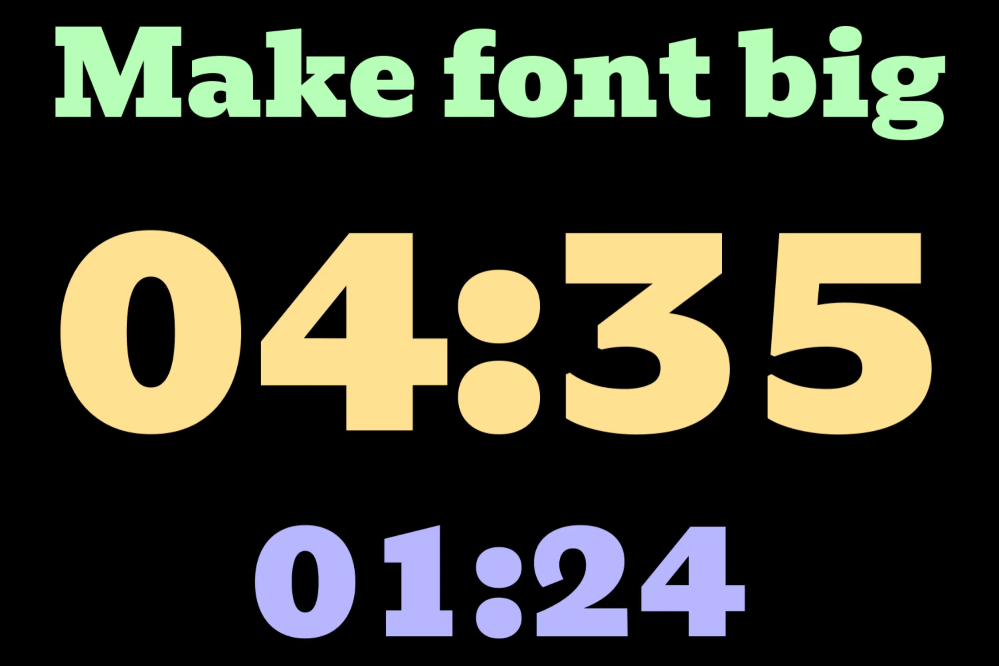
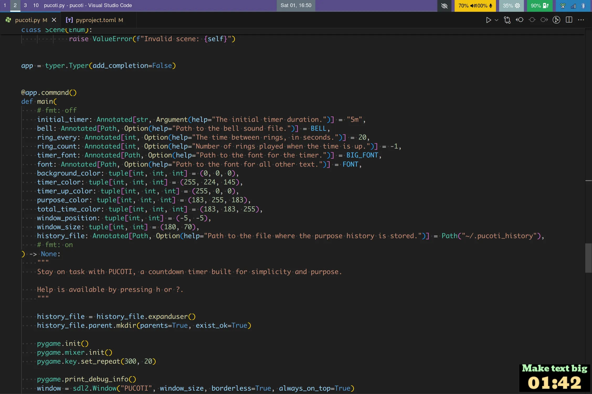
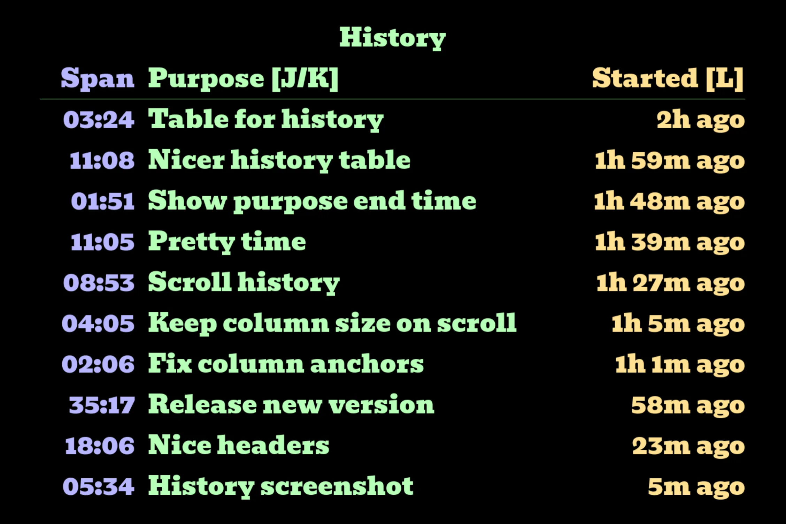
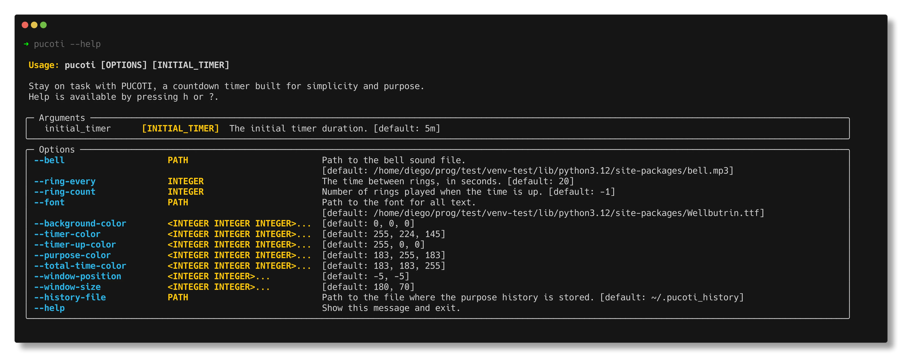

# PUCOTI

**A Purposeful Countdown Timer**

Stay on task with PUCOTI, a countdown timer built for simplicity and purpose.

### Features:
- **Countdown**: Counts down to zero (and can go below zero).
- **Bell Alert**: Rings a bell when it hits zero.
- **Persistent Reminder**: Rings every 20 seconds until you acknowledge it. Don't forget to do the thing.
- **Set Intentions**: Write down what you intend to do during the countdown.
- **History**: Keeps a log of your intentions and how long you spent on each.
- **Large Font**: Uses the biggest font it can for visibility.
- **Sway Integration**: Automatically moves to the corner of your screen if you use Sway WM.
- **Total Time**: Shows the total time you've spent on the timer.
- **Configurable**: Change the bell sound, waste time changing colors, and more.
- **Basic Controls**: Add or subtract time, reset the timer, but not more.
- **No Pause**: No pause button. Time always moves forward.

PUCOTI is straightforward and gets the job done. Give it a try.

## Screenshots

### *Pucoti can be big...*

### *... or stay in a corner*

### *Keep track of your intentions*


## Installation

You can easily install PUCOTI using pip. Follow these steps:

1. **Install PUCOTI:**
   ```sh
   pip install pucoti
   ```

2. **Run PUCOTI:**
   ```sh
   pucoti 5m
   ```

That's it! PUCOTI should now be up and running.

## Usage



## Telemetry

I collect minimal anonymous usage statistics to prioritise per-platform
development. On startup, PUCOTI sends its version and basic OS/desktop metadata.
It also reports when you use some specific features (e.g. joining a room).  You
can see what is sent in [telemetry.py](./src/pucoti/telemetry.py) and
desactivate it by passing `--no-telemetry` or setting `telemetry = false` in the
config file.

It also lets me know how many people use PUCOTI, and this motivates me a lot to
keep making it better!


## Contributors

A warm thank you to all the contributors who have helped make PUCOTI better and gave their precious time 💖⌛
- [@niajane](https://github.com/ddorn/pucoti/commits?author=niajane)
